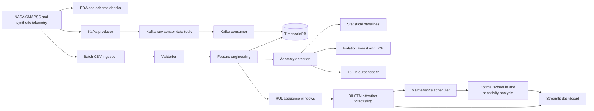

# Predictive Maintenance and RUL Forecasting Platform

## Executive Summary

Industrial equipment failures create unplanned downtime, repair cost spikes, safety risks, and production delays. This project builds a predictive maintenance platform that turns sensor telemetry into operational decisions: anomaly detection, remaining useful life forecasting, and optimized maintenance scheduling.

The project uses the NASA CMAPSS turbofan dataset as the main sequential maintenance dataset, supported by synthetic telemetry for controlled anomaly testing. The system includes dataset understanding, feature engineering, batch and streaming ingestion paths, anomaly detection baselines, an LSTM autoencoder, supervised RUL sequence modeling, MLflow experiment tracking, a PuLP-based maintenance scheduler, and a Streamlit dashboard for demo and inspection.

The current anomaly evaluation meets the core anomaly-quality target with several models above F1 `0.88`. MAD and z-score both reach F1 `0.9317`, while the LSTM autoencoder reaches ROC-AUC `0.9670`, PR-AUC `0.9667`, F1 `0.9250`, and a low false alarm rate of `0.65%`. The latest RUL forecast run reports RMSE `35.34`, MAE `25.77`, R2 `0.56`, and MAPE `21.94%`; this is useful for the downstream scheduling prototype but does not yet meet the PDF target of MAPE `<= 12%`. The scheduler converts forecast outputs into an optimal 12-task maintenance plan with sensitivity analysis across downtime, labor, and parts-cost scenarios.

## Business Case and Objectives

The target use case is industrial predictive maintenance for high-value rotating equipment such as turbines, motors, pumps, compressors, and production-line assets.

The business goals are:

- reduce unplanned downtime by detecting abnormal behavior earlier
- support maintenance teams with predicted remaining useful life
- reduce maintenance waste by scheduling work based on risk and cost
- provide a clear dashboard for engineering and operations review
- make model outputs reproducible through saved artifacts and experiment tracking

Key technical objectives:

- load and understand time-series equipment data correctly
- avoid leakage by keeping sequence and unit structure explicit
- compare simple anomaly methods against deep sequence methods
- train a supervised RUL forecasting model
- turn forecasts into cost-aware maintenance decisions
- expose the latest outputs through a deployable dashboard

## Functional Requirements

| ID | Capability | Current Implementation | Status |
| --- | --- | --- | --- |
| F-01 | Real-time and batch ingestion | Kafka producer/consumer path plus Airflow batch DAG | Implemented locally |
| F-02 | Time-series feature engineering | Rolling stats, lag features, FFT amplitudes, sensor ratios | Implemented |
| F-03 | Anomaly detection | Isolation Forest, LOF, z-score, MAD, LSTM autoencoder | Implemented |
| F-04 | RUL forecasting | BiLSTM with attention, sequence windows, Optuna tuning, Prophet hybrid support | Implemented; target quality not fully met |
| F-05 | Maintenance scheduler | PuLP optimization with cost and resource assumptions | Implemented |
| F-06 | Dashboard and reporting | Streamlit multipage app with overview, equipment, alerts, reports | Implemented |
| F-07 | Monitoring and retraining | MLflow tracking and monitoring notes; full retraining loop not yet productionized | Partial |

## Technology Stack

| Layer | Technology | Reason |
| --- | --- | --- |
| Dataset | NASA CMAPSS | Standard benchmark for turbofan degradation and RUL modeling |
| Processing | pandas, numpy, scipy | Reliable tabular and time-series preprocessing |
| Validation | Great Expectations-style checks | Schema, null, duplicate, and range validation |
| Streaming | Kafka | Realistic event-streaming architecture for telemetry |
| Batch orchestration | Airflow | DAG-based repeatable ingestion and feature pipeline |
| Storage | PostgreSQL + TimescaleDB | Time-series storage with SQL ecosystem |
| Modeling | scikit-learn, PyOD, PyTorch Lightning | Baselines plus deep sequence models |
| Tuning | Optuna | Controlled hyperparameter search |
| Tracking | MLflow | Reproducible model and artifact tracking |
| Optimization | PuLP | Maintenance scheduling as a mixed-integer optimization problem |
| Dashboard | Streamlit, Plotly | Fast deployable inspection UI |
| Packaging | Docker | Portable deployment path for dashboard |

## Architecture Overview

```text
NASA CMAPSS / Synthetic telemetry
        |
        +--> EDA and schema checks
        |
        +--> Batch CSV pipeline --> validation --> feature engineering --> TimescaleDB
        |
        +--> Kafka producer --> raw sensor topic --> consumer --> TimescaleDB
        |
        +--> Anomaly detection
        |       +--> statistical methods
        |       +--> tree/local density methods
        |       +--> LSTM autoencoder
        |
        +--> RUL sequence preparation --> BiLSTM attention model --> predictions
        |
        +--> Maintenance scheduler --> optimal schedule + sensitivity analysis
        |
        +--> Streamlit dashboard --> overview, equipment detail, alerts, reports
```

Mermaid architecture diagram for the final PDF:



## Data Understanding

The main dataset is NASA CMAPSS FD001. Each row represents one engine unit at one cycle, with operating settings and sensor values. Training units run until failure, so train RUL is derived from each unit's final cycle. Test units stop before failure, and the provided RUL file supplies the remaining life after the final observed test cycle.

Important EDA findings:

- train rows: `20631`
- test rows: `13096`
- train units: `100`
- test units: `100`
- constant or low-value columns include `setting_3`, `sensor_1`, `sensor_5`, `sensor_10`, `sensor_16`, `sensor_18`, and `sensor_19`
- high-variability and degradation-relevant sensors include `sensor_9`, `sensor_14`, `sensor_4`, and `sensor_3`
- missing values were not found in the initial FD001 analysis

## Feature Engineering

The feature pipeline builds time-aware telemetry features:

- rolling mean, standard deviation, min, and max over 1h, 8h, and 24h windows
- lag features from lag 1 to lag 12
- FFT top-frequency amplitudes
- cross-sensor ratios

These features support both batch analytics and model training by capturing local behavior, temporal memory, frequency signatures, and relationships between sensors.

## Anomaly Detection

The anomaly track intentionally compares simple and deep approaches.

Methods implemented:

- Isolation Forest
- Local Outlier Factor
- z-score distance
- MAD distance
- LSTM autoencoder

Current saved comparison:

| Method | ROC-AUC | PR-AUC | F1 | Precision | Recall | False Alarm Rate | Interpretation |
| --- | ---: | ---: | ---: | ---: | ---: | ---: | --- |
| MAD | 0.9485 | 0.9526 | 0.9317 | 1.0000 | 0.8721 | 0.0323 | Best current F1 with robust scoring |
| z-score | 0.9443 | 0.9489 | 0.9317 | 1.0000 | 0.8721 | 0.0323 | Tied F1 with MAD and easy to explain |
| LSTM Autoencoder | 0.9670 | 0.9667 | 0.9250 | 1.0000 | 0.8605 | 0.0065 | Best ranking metrics and lowest false alarm rate |
| Local Outlier Factor | 0.9264 | 0.9364 | 0.9317 | 1.0000 | 0.8721 | 0.0387 | Strong local-density baseline |
| Isolation Forest | 0.7642 | 0.7100 | 0.7027 | 0.8387 | 0.6047 | 0.0710 | Weakest current method |

Key learning: the deep model is useful and has the strongest ranking metrics, but robust statistical methods still produce the best F1 under the selected operating threshold. This makes the model comparison more credible because selection is based on evidence, not model complexity.

## RUL Forecasting

The RUL track prepares sliding windows from unit histories and aligns each window with a target RUL value. The main supervised model is a bidirectional LSTM with temporal attention, trained with PyTorch Lightning and tuned with Optuna.

Latest checked RUL metrics:

| Metric | Value |
| --- | ---: |
| RMSE | 35.34 |
| MAE | 25.77 |
| R2 | 0.56 |
| MAPE | 21.94% |
| Median absolute error | 18.84 cycles |
| Predictions within 20 cycles | 52.67% |

The model is strong enough to support a demo and downstream scheduling prototype, but it does not yet meet the PDF target of MAPE `<= 12%`. The next improvement work should focus on capped RUL targets, stronger baseline comparison, error analysis near failure cycles, and loss shaping for late-life predictions.

## Maintenance Optimization

The scheduler converts predictions into a practical maintenance plan using PuLP. It models maintenance as an optimization problem with downtime, repair, labor, technician capacity, parts, and risk assumptions.

Current Week 2 checkpoint:

- solver status: `Optimal`
- scheduled tasks: `12`
- total cost: `$1,066,287.97`
- direct cost: `$984,000.00`
- risk cost: `$82,287.97`
- downtime hours: `80`
- technician hours: `160`
- on-or-before preferred rate: `50%`

Sensitivity scenarios include base, high downtime, high labor, high parts, low downtime, and stress case. The schedule is stable in most scenarios, with assignment changes mainly under high downtime or stress assumptions.

## Dashboard and Demo Surface

The dashboard is a Streamlit multipage application:

- Overview: schedule health, cost, and sensitivity analysis
- Equipment Detail: unit-level predictions and maintenance recommendations
- Alerts Configuration: threshold and severity rule draft
- Reports: downloadable schedules and summary outputs

The dashboard reads saved experiment artifacts and includes fallback sample data so it can still launch in hosted or clean environments.

## MLOps and Production Readiness

Current production-readiness pieces:

- repeatable source modules in `src/`
- unit tests for key components
- saved experiment artifacts under `Data/experiments/`
- MLflow logging support for anomaly and sequence experiments
- Dockerfile for Streamlit dashboard deployment
- Airflow DAG for batch ingestion and feature loading
- TimescaleDB schema initialization files
- local and hosted Streamlit deployment path

Remaining production gaps:

- full cloud Kubernetes deployment is not completed
- full automated drift-to-retraining loop is not productionized
- public demo URL should be rechecked before submission
- final report PDF has been exported; voice-over demo video still needs to be recorded/uploaded from the prepared script and storyboard assets

## Verification Evidence

The following commands generate the current evidence files:

```bash
python -m src.evaluate_anomaly
python -m src.evaluate_rul
python -m src.benchmark_latency --iterations 3 --max-tasks 12
python -m pytest tests/test_anomaly_baseline.py tests/test_anomaly_lstm_autoencoder.py tests/test_kafka_to_timescaledb_consumer.py tests/test_sequence_data.py tests/test_sequence_attention_model.py tests/test_maintenance_scheduler.py -q
```

Generated evidence:

- `reports/anomaly_acceptance_metrics.csv`
- `reports/anomaly_acceptance_metrics.json`
- `reports/rul_acceptance_metrics.json`
- `reports/latency_benchmark.json`
- `reports/Predictive_Maintenance_RUL_Report.pdf`
- `reports/screenshots/`
- `reports/demo_assets/demo_storyboard.gif`

Latest focused test result:

- `38 passed`

Latest local benchmark result:

- batch artifact load median latency: `0.023 s`
- scheduler solve median latency with 12 tasks: `0.243 s`

These benchmarks are local artifact and scheduler checks. They do not prove production streaming latency, public endpoint latency, or high-concurrency throughput.

## Security, Privacy, and Ethics

The project uses public benchmark data and synthetic telemetry, so it does not contain personal information. In a real deployment, equipment identifiers should be hashed or mapped to internal IDs, credentials should be stored in environment variables or a secret manager, and dashboard/API access should use authentication and role-based permissions.

Operational safeguards should include:

- no hard-coded credentials
- input validation on telemetry records
- audit logs for predictions and maintenance decisions
- clear labeling of model uncertainty and decision assumptions
- human approval before high-impact maintenance actions

## Known Limitations

- RUL MAPE is `21.94%`, so the current forecasting model does not meet the PDF target of `<= 12%`.
- Full JWT/RBAC authentication is not implemented in the dashboard.
- HTTPS/TLS depends on the deployment host and is not proven by the local run.
- Kubernetes, HPA, and GPU scaling are documented as target architecture but not implemented.
- The monitoring story has MLflow and notes, but not a full drift-to-retraining production loop.
- Streaming latency and million-scale throughput are not proven with load tests.
- Alerting is currently a dashboard configuration surface, not a persisted multi-channel alert delivery service.

## Challenges and Learnings

Key challenges:

- understanding that CMAPSS is sequential unit data, not ordinary tabular rows
- deriving RUL targets correctly without leakage
- comparing anomaly methods fairly across row-level and window-level outputs
- keeping simple baselines visible even after adding deep learning
- converting prediction outputs into operational maintenance decisions
- making Streamlit imports work both locally and in hosted deployment

Key learning: a good predictive maintenance project is not just a model. It needs data understanding, leakage-safe evaluation, reproducible artifacts, decision logic, and a clear interface for stakeholders.

## Personal Reflection

This project helped me understand predictive maintenance as an end-to-end decision system rather than a single modeling task. The most important lesson was that sequence data has its own rules: engine units, cycles, RUL alignment, and leakage-safe splitting matter before any model architecture matters.

I also learned that simple baselines are not just a formality. The anomaly track showed that robust statistical methods can compete with deep sequence models, and that model selection should be based on operating metrics such as F1 and false alarm rate. The scheduling layer made the business value clearer because it translated predictions into maintenance actions, costs, and trade-offs.

For industry readiness, the strongest parts of the project are the reproducible pipeline structure, saved artifacts, tests, scheduler, and dashboard. The main areas I would improve next are RUL forecast accuracy, uncertainty intervals, authentication, and production monitoring.

## Final Submission Assets

Current assets ready or nearly ready:

- source code in `src/`
- notebooks in `notebooks/`
- reports in `reports/`
- dashboard in `app/`
- scheduler outputs in `Data/experiments/week2_checkpoint/`
- RUL prediction outputs in `Data/experiments/day9_sequence_training/`
- anomaly outputs in `Data/experiments/anomaly_day6/`
- tests in `tests/`
- deployment files in `deploy/`

Final work before submission:

- record a 4 to 8 minute voice-over walkthrough video
- verify or deploy the hosted Streamlit URL
- package GitHub link, demo link, video link, and PDF together
